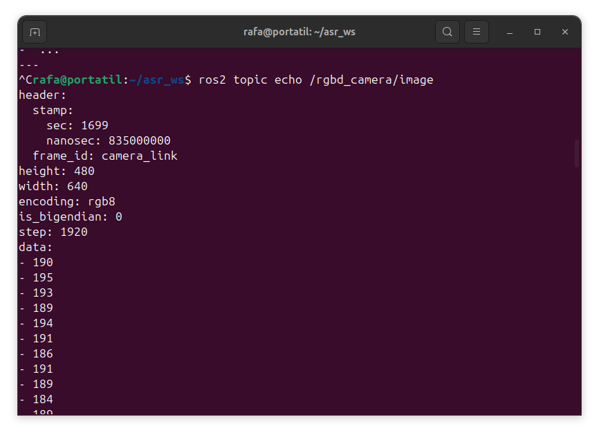
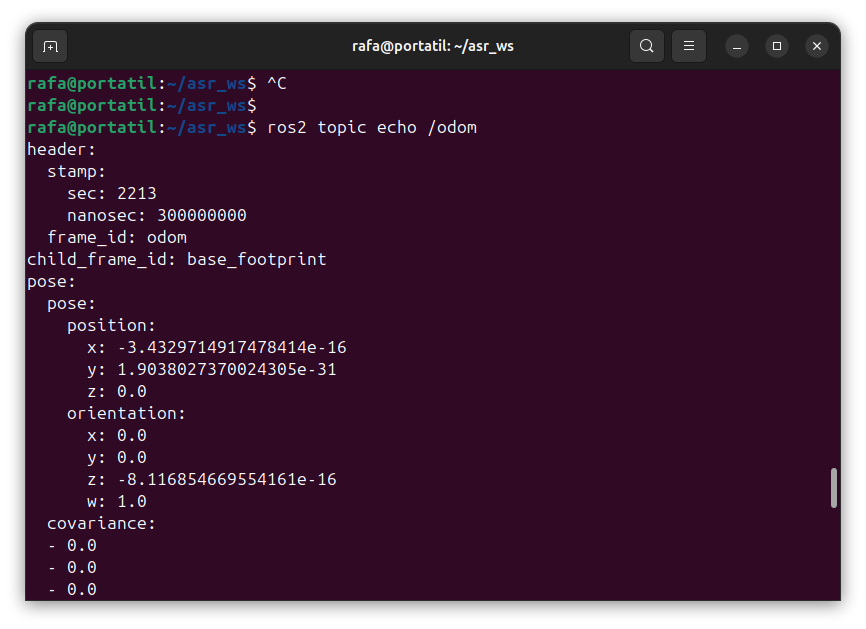
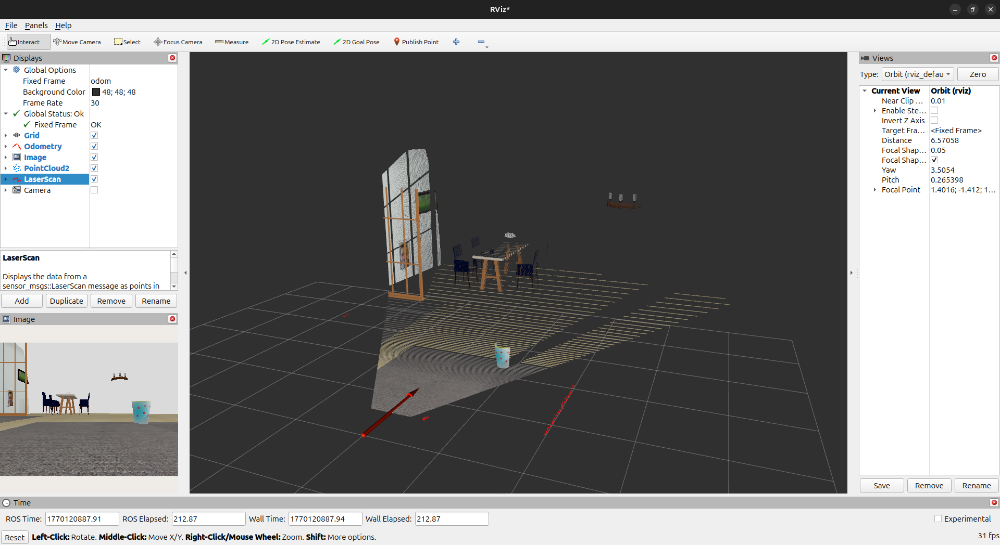
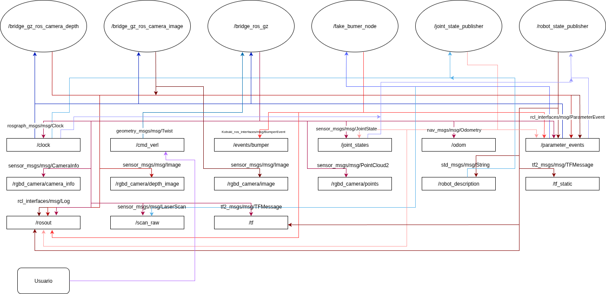

# Práctica 1: Entorno de desarrollo y primer sistema ROS 2

## Objetivo y desarrollo de la practica

En esta practica se comprobara que el entorno de desarrollo de ROS 2 este correctamente configurado y ser capaz de ejecutar el simulador de kobuki.

## Guion de desarrollo

### Paso 0: Verificación de instalación y entorno.

1. Abrir una terminar y verificar que ROS 2 está instalado.

2. Identificar la distribución activa.

    Para responder a las dos preguntas anteriores podemos ejecutar en una terminar `echo $ROS_DISTRO` que da como salida `jazzy`.

3. Activa el entorno base de ROS 2.
    
    Para activar el entorno ejecutamos `source /opt/ros/jazzy/setup.bash`.
    Para que sea persistente modificamos el fichero .bahsrc añadiendo esa linea.

### Paso 1: Creación de un workspace de trabajo.

1. Crear un directorio de workspace con la estructura estándar scr.
    
    Lo creamos con `mkdir asr_ws` y dentro creamos el scr

2. Acceder al directorio raíz del workspace.
    
    Accedemos con `cd asr_ws`

### Paso 2: Clonación del repositorio del Kobuki.

1. Clonar el repositorio https://github.com/IntelligentRoboticsLabs/ASR-Software en el directorio src. 
    
    Clonamos con `git clone <url del repo>`

2. Verificar que se han incorporado paquetes ROS 2.

    Para verificar que los paquetes de ros 2 se han incorporado correctamente usamos `ros2 pkg list` y podremos ver la lista de paquetes disponibles.

### Paso 3: Compilación del workspace con colcon.

1. Compilar el workspace con colcon build.
    
    Para compilar el workspace usamos `colcon build --symlink-install`.

2. Verificar la generación de los directorios build, install y log.
    
    Lo podemos verificar usando `ls` y podemos ver las carpetas creadas.

### Paso 4: Activación del workspace.

1. Activar el entorno generado por el generado por el workspace mediante el script `install/setup.bash`.

2. Verificar que los paquetes del workspace son visibles para ROS 2.
    
    Para verificar podemos volver a usar `ros2 pkg list` y podremos ver los paquetes nuevo que reconoce ros.

### Paso 5: Lanzamiento de la simulación.

1. Lanzar el sistema de simulación del Kobuki usando ros2 launch.
    
    Para lanzar el simulador usamos `ros2 launch kobuki simulation.launch.py`

2. Mantener el sistema en ejecución en una terminal dedicada.

### Paso 6: Análisis del sistema con ros2cli.

1. Listar nodos en ejecución.
    
    Con el comando `ros2 node list` obtenemos los siguientes nodos:
    
    - /bridge_gz_ros_camera_depth
    - /bridge_gz_ros_camera_image
    - /bridge_ros_gz
    - /fake_bumer_node
    - /joint_state_publisher
    - /robot_state_publisher

2. Identificar topics relevantes (sensores, odometría, comandos).

    Con el comando `ros2 topics list` vemos los topics, entre ellos pueden destacar:
    
    - Sensores: /rgbd_camera/camera_info /rgbd_camera/depth_image /rgbd_camera/image /rgbd_camera/points /scan_raw /joint_states
    - Odometría: /odom
    - Comandos: /cmd_vel

3. Inspeccionar el tipo de mensajes en los topics principales.
    - sensores: sensor/msg/
    - Odometría: nav_msgs/msg/
    - Comandos: geometry_msgs/msg/

4. Observa mensajes en tiempo real en al menos dos topics (uno sensorial y uno de estado).

    Para ver un mensaje de un topic en tiempo real usamos ros2 `topic echo <topic>`. Obteniendo:

    Mensaje en tiempo real de la imagen de la camara.
    
    

    Mensaje en tiempo real de la odometría.

    

5. Medir la frecuencia de publicación de un topic (por ejemplo odometría o laser).

    Para ver la frecuencia de un topic podemos usar `ros2 topic hz <topic>`. obtemos como salida un avarage rate de aproximadamente 48 hz

6. Localizar el topic de velocidad y publicar un comando de prueba (si procede según el sistema)

    Con `ros2 topic list` podemos ver el topic /cmd_vel que corresponde con la velocidad angular y lineal. Luego `ros2 topic info /cmd_vel` vemos a que interfaz pertenece, asi con `ros2 interface show geometry_msgs/msg/Twist` podremos ver como expresa las velocidades.

    De esta manera podremos usar `ros2 topic pub /cmd_vel geometry_msgs/msg/Twist "{linear: {x: 0.2}, angular: {z: 0.0}}"` para hacer que el robot se mueva linealmente a 2 m/s. En el siguiente video se puede ver una demostración.

     

    También se probo en el robot real como se ve en el siguiente video, aunque en este caso lo hicimos girar cambiando su velocidad angular.

    
    
    Nota: en caso de querer ver el video con mas calidad se puede descargar desde la carpeta `img/` del repositorio.

7. Inspeccionar el estado del sistema y visualizar los sensores del robot con RViz2.
   
   En la siguiente imagen se pueden observar los sensores del robot como la camara, el laser y la odometría.
   
   

### Paso 7: Dibujar el diagrama de procesos, nodos y topics

Diagrama de procesos, nodos y topics.

