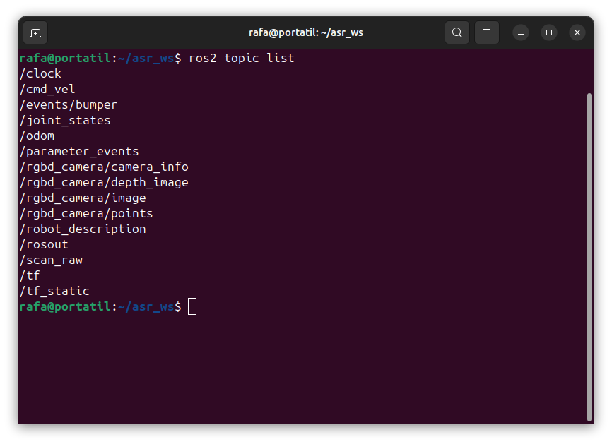
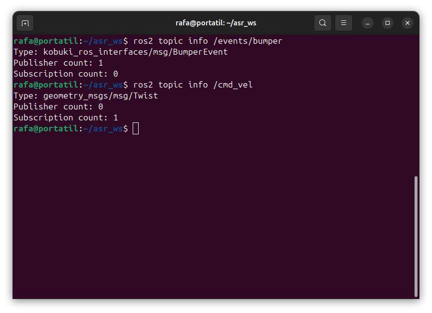
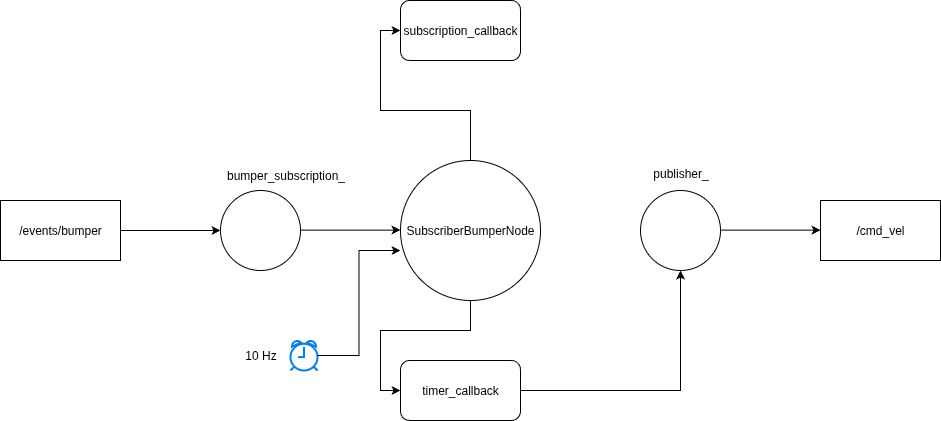

# Práctica 1: Teleoperación reactiva con bumper (Kobuki)

## Objetivo y desarrollo de la práctica

El objetivo de esta práctica es implementar un teleoperador reactivo usando el bumper del Kobuki. Tendrá que empezar parado y según que bumper este pulsado tendrá que moverse en una dirección o en otra. En concreto si el centra esta pulsado hacia adelante, si el derecho gira hacia la derecha y si es el izquierdo gira hacia la izquierda.

## Guion de desarrollo

### Paso 1: Identificar topics y tipos de mensajes

* El topic del bumper del Kobuki (evento de pulsación)
  
  Ejecutamos `ros2 topic list` para poder ver el topic del bumper.

  

  Podemos observar que el topic del evento de pulsación del bumper es `/events/bumper`.

* El topic de comandos de velocidad 

    Ya sabemos de la anterior practica que este topic es `/cmd_vel`.

* El tipo de mensajes en ambos topics.

    Mediante el comando `ros2 topic info <topic>` podemos ver el tipo de mensaje del topic.

    

    Como se ve en la captura el topic `/events/bumper` es de tipo `kobuki_ros_interfaces/msg/BumperEvent` y el topic `/cmd_vel` es de tipo `geometry_msgs/msg/Twist`.

### Paso 2: Subscriptor que muestre cambios del bumper

Implementar un nodo con un subscriptor al topic del bumper que imprima con `RCLCPP_INFO` solo cuando cambia el estado.

* Debe mostrarse que bumper cambia y si se pulsa o se suelta
* La salida debe ser clara para depurar

Para la implementación del nodo se partió del código de los ejemplos en `ch2_examples`. A continuación se explicara las partes mas destacadas del este.

*[SubscriberBumperNode.cpp](/src/teleop_bumper_kobuki/src/teleop_bumper_kobuki/SubscriberBumperNode.cpp)*
```cpp
bumper_subscription_ = create_subscription<kobuki_ros_interfaces::msg::BumperEvent>(
        "/events/bumper", 10,
    std::bind(&SubscriberBumperNode::subscription_callback, this, std::placeholders::_1));
```

En el constructor del nodo nos creamos la subscripción de tipo `rclcpp::Subscription<kobuki_ros_interfaces::msg::BumperEvent>::SharedPtr` que se suscribe a `/events/bumper` y la bindeamos al método subscription_callback.

### Paso 3: Lazo de control con timer a 10 Hz.

Añadir al nodo un temporizador a 10 Hz que imprima el estado actual del bumper aunque no haya eventos nuevos.
Hay que distinguir entre:
* El evento (callback del bumper)
* El ciclo de control periódico que consulta ese estado.

*[`SubscriberBumperNode.cpp`](/src/teleop_bumper_kobuki/src/teleop_bumper_kobuki/SubscriberBumperNode.cpp)*
```cpp
timer_ = create_wall_timer(
        100ms, std::bind(&SubscriberBumperNode::timer_callback, this));
```

En el constructor del nodo tenemos el constructor de un timer de tipo `rclcpp::TimerBase::SharedPtr` a 100 ms (10 Hz) y se bindea al metodo timer_callback que sera nuestro ciclo de control. El evento es el callback del bumper que nos actualiza cada vez que este cambia.

### Paso 4: Generación y publicación de velocidades

Modificar el lazo del control para que, en lugar de solo imprimir, publicar que las velocidades correctas en `/cmd_vel` según las reglas del objetivo.

*[`SubscriberBumperNode.cpp`](/src/teleop_bumper_kobuki/src/teleop_bumper_kobuki/SubscriberBumperNode.cpp)*
```cpp
publisher_ = create_publisher<geometry_msgs::msg::Twist>(
        "/cmd_vel", 10);
```

Primero, en el constructor del nodo creamos un publicador de tipo `geometry_msgs/msg/Twist` que publicara en `/cmd_vel`.

*[`SubscriberBumperNode.cpp`](/src/teleop_bumper_kobuki/src/teleop_bumper_kobuki/SubscriberBumperNode.cpp)*
```cpp
void
SubscriberBumperNode::movement(double v, double w)
{
  // Movimiento lineal
  vel_msg_.linear.x = v;

  // Movimiento angular
  vel_msg_.angular.z = w;
  publisher_->publish(vel_msg_);

  RCLCPP_INFO(get_logger(), "Publishing v: %f, w: %f", vel_msg_.angular.x, vel_msg_.angular.z);

}
```
Para publicar las diferentes velocidades se implemento un función que recibe la velocidad lineal y angular que se publicara posteriormente. 

#### Demostración de funcionamiento en robot real


Nota el video esta disponible a mas calidad en [`img/`](img/)

### Paso 5: Esquema de diseño

Diagrama de diseño:

