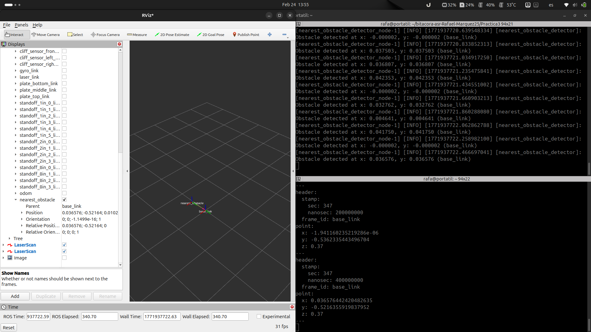
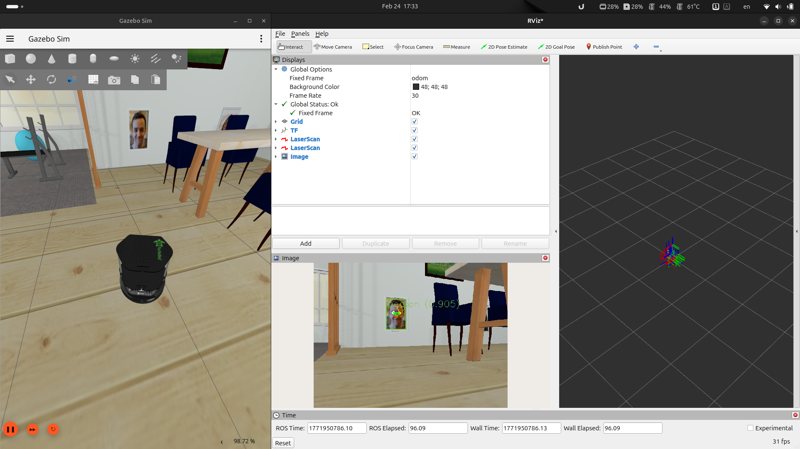
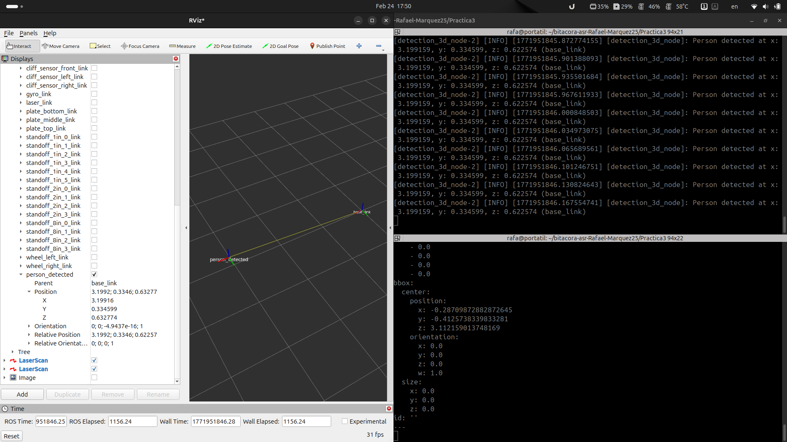

# Practica 3: Seguimiento de un objeto/persona con detecciones 2D/3D y evitación con láser.

## Objetivo y desarrollo de la practica.

El objetivo es implementar un robot que siga una persona detectado con la cámara usando yolo y aproximándose a una distancia de 1-2 metros. Al mismo tiempo debe evitar obstáculos en la trayectoria hacia el objetivo.

## Guion de desarrollo.

### Paso 1: Obstáculo mas cercano con láser.

En este paso se recibe un `sensor_msgs/msg/laserScan`, localiza el obstáculo mas cercano y calcula su posición 2D.
Ademas publica el resultado en `/nearest_obstacle` como `geometry_
msgs/msg/PointStamped` expresado en el marco del robot (base_link).
Por ultimo publica una TF en el marco del robot (base_link) propia asociada al obstáculo mas cercano.

### Paso 2: Detección 2D de una persona.

En paso recibe una imagen `sensor_msgs/msg/Image` y publica una detección de tipo `vision_msgs/msg/Detection2DArray`.

Para implementar esto primero lanzamos yolo con `ros2 launch yolo_bringup yolo.launch.py model:=yolov8m-pose.pt threshold:=0.8 input_image_topic:=/rgbd_camera/image use_tracking:=False`. Luego lanzamos el ejecutable llamado `yolo_detection` del paquete `camera` de `ch3_examples` y el nodo creado para este paso `detection_2d_node`.

Como el nodo `yolo_detection` publica incluso cuando no detecta nada, el nodo creado se suscribe al nodo `yolo_detection` y si el mensaje no esta vació publica un `vision_msgs/msg/Detection2DArray` en `/detection_2D`.

### Paso 3: Detección 3D.

Lanzamos el nodo `detection_2d_to_3d_depth` del paquete camera y a partir del `vision_msgs/msg/Detection2DArray` que se publica en `/detection_2D`, este nodo nos publicara un `vision_msgs/msg/Detection3DArray` que usara el nodo de este paso `detection_3d_node`.

Este nodo elige que persona de los todos los trakings que recibe usa para publicarlo en `/detection_3d` (expresado en `camera_link`) y su TF propia expresada en `base_link`.

### Paso 4, 5 y 6: Control de orientación hacia la detección, Control de distancia y evitación de obstáculos.

Para el paso 4 el robot gira hasta que encuentra un obstáculo el que esquivar o una persona a la que seguir

Para el 5 el robot si recibe una detección 3d y no esta detectando un obstáculo procede a seguirlo

Por ultimo para el paso 6 si esta detectando un obstáculo prioriza esquivarlo aunque eso le conlleve a perder a la persona porque si la pierde vuelve al paso 4 y vuelve a empezar el ciclo. Y solo tendrá en cuenta los obstáculos que estén en un cono de 60 grados que se considera que es hacia donde el robot puede avanzar, esto se puede mejorar calculando el fov de la cámara pero eso no esta implementado.

### Video Demostración

