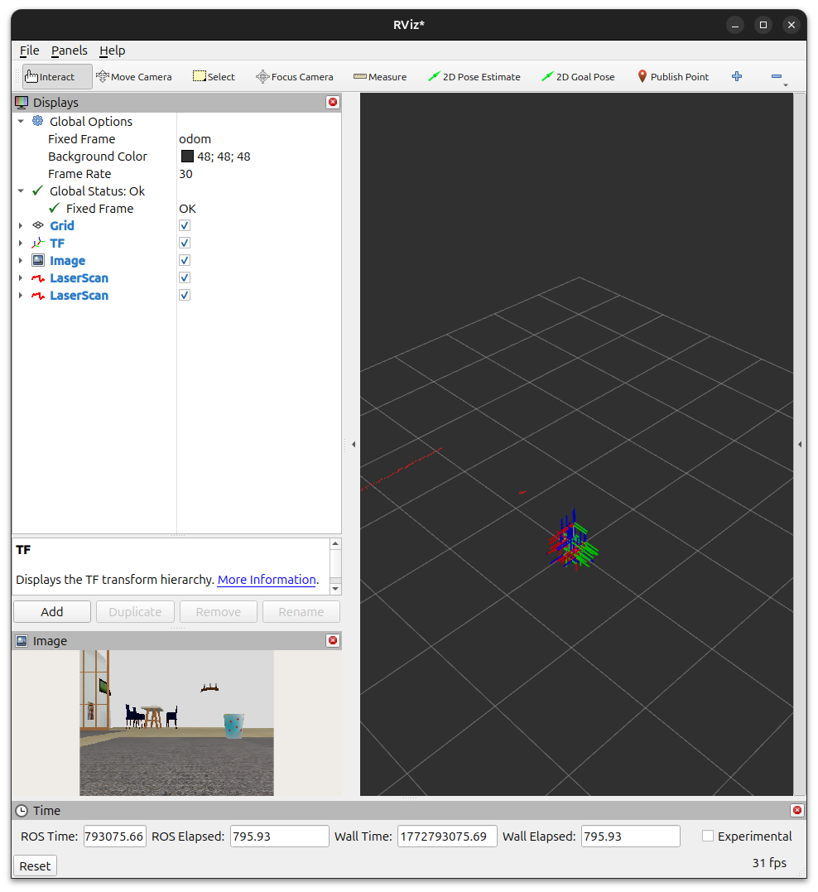
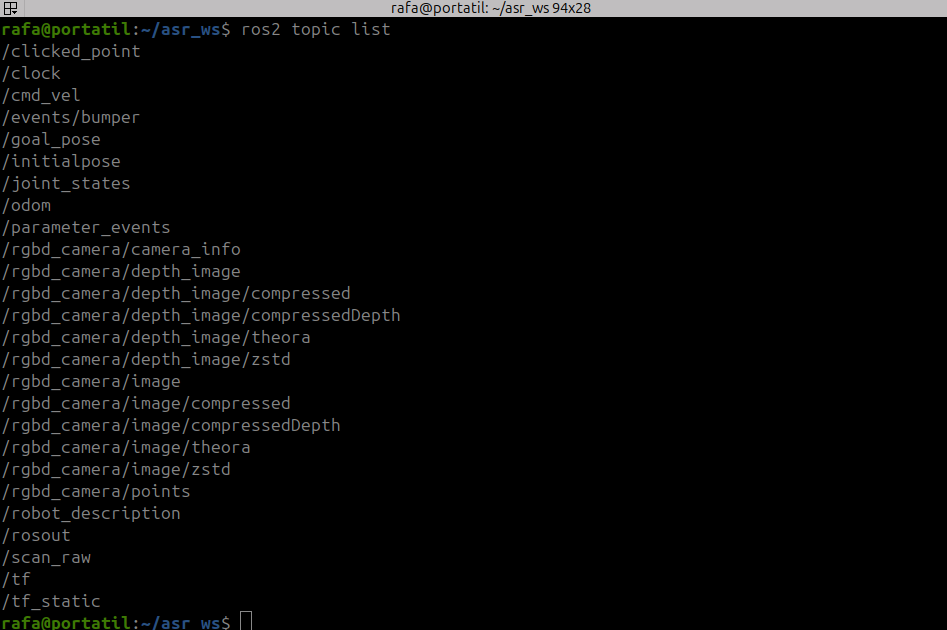
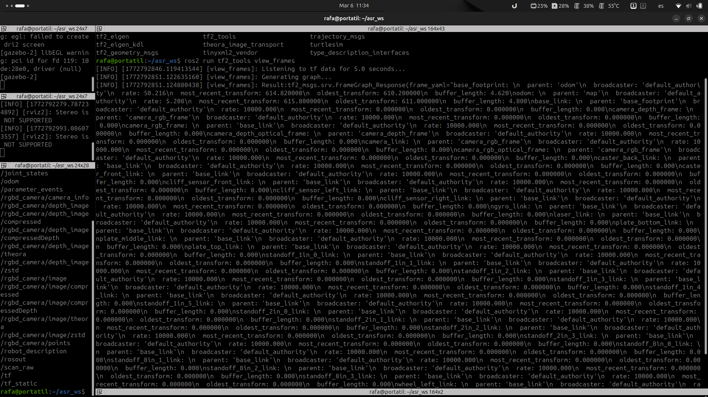
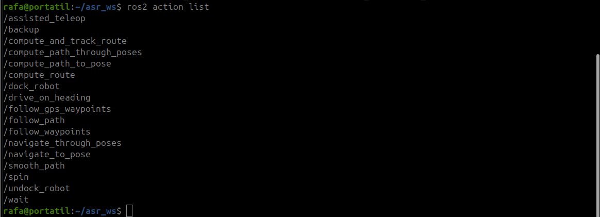

# Practica 4 Navegación con Nav2 y patrullaje mediante FSM

## Guion de desarrollo

### Paso 1: Preparación del entorno y del robot

1. Lanzar el entorno de simulación de robot y la capacidad de navegación.

2. Abrir RViz2 y verificar la configuración visual del robot

    

3. Identificar y listar los topics relevantes

    

4. Verificar que las transformadas del robot están correctamente publicadas

    

    El `ros2 run tf2_tools view_frames` comando te da la siguiente salida. Pero también te genera un pdf con el [grafo de transformadas](img/frames_2026-02-20_21.16.45.pdf).

### Paso 2: Capacidad de navegación con Nav2

1. Lanzar Nav2 indicando el mapa sobre el cual navegar

    

2. Validar la navegación mediante objetivos manuales

    

### Paso 3: Misión de patrullaje con FMS

En el siguiente video se puede ver como funciona la misión de patrullaje donde en el archivo yalm tenemos tres puntos (los dos del video y uno que no es valido), pudiendo observar como patrulla entre ellos y omite el que esta fuera del mapa.

Ademas vemos la trazabilidad en el log con información de la misión, el estado de la fms y el waypoint actual, estos dos últimos en sus correspondientes topics que solo se publican cuando cambian de estado en el caso de la fms y solo cuando se envía un nuevo waypoint en el caso de este.

