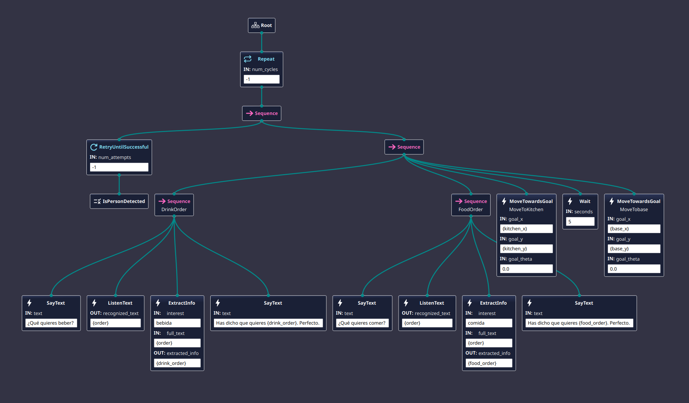

# Practica 5 Robot camarero - Misión con Behavior Trees

## Guion de desarrollo

### Paso 1: Preparación del entorno y capacidad de navegación

1. Verificar que el robot simulado esta operativo.

2. Confirmar que se dispone de un mapa del entorno navegable

3. Lanzar Nav2 con el mapa y verificar que la navegación funciona correctamente.

    

4. Identificar y anotar las coordenadas de las ubicaciones relevantes

    En este caso para la que la depuración sea mas fácil se ha elegido como puntos:

    kitchen_x: 1.0 y kitchen_y: 1.0

    base_x: 0.0 y base_y: 0.0

    Aunque se pueden cambiar fácilmente modificando el `params.yaml`

### Paso 2: Capacidad de dialogo y detección de presencia

1. Implementar una capacidad simple de detección de presencia:

    Para esta parte se uso `YOLO`, es un nodo bt que retorna `FAILURE` si no esta detectando a nadie y retorna `SUCCESS` si detecta a una persona.

2. Implementar e integrar un nodo bt que permita hablar

    En este caso el nodo implementado se basa en los ejemplos proporcionados en este caso es `say_text_action` y `say_text_client`.

3. Implementar e integrar un nodo bt que permita tomar pedidos

    Para este nodo se usa `listen_text_action`, `say_text_action` y `extract_info_action` en conjunto para crear la capacidad de tomar el pedido.

4. Implementar e integrar un nodo bt que permita al robot navegar

    En este paso se una el nodo proporcionado en los ejemplos `move_towars_goal_action`.

### Paso 3: Behavior Tree completo de la misión

En este paso se implementa la misión completa del robot camarero como
un único Behavior Tree, integrando todas las capacidades validadas.

Video demostración.

Aunque se puede observar que la extracción de texto del pedido no es perfecta, se ve el comportamiento del robot perfectamente. Esto es que detecte a alguien, hable, escuche y navegue.

